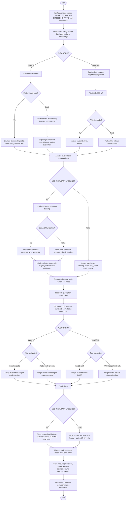

# Draft Penyesuaian Thesis vs Implementasi Kode

Dokumen ini merangkum penyesuaian flow thesis agar konsisten dengan implementasi aktual di kode.

## 1) Flow Final (Yang Benar-Benar Terjadi di Kode)

### Step 1 - Konfigurasi eksperimen
- Dataset, algoritma, embedding type ditetapkan di konfigurasi pipeline.
- Referensi: [cluster_testing_pipeline.py](cluster_testing_pipeline.py#L67), [cluster_testing_pipeline.py](cluster_testing_pipeline.py#L68), [cluster_testing_pipeline.py](cluster_testing_pipeline.py#L69).

### Step 2 - Load hasil training
- Load label cluster training (dan model KMeans jika mode KMeans).
- Referensi: [cluster_testing_pipeline.py](cluster_testing_pipeline.py#L2528), [cluster_testing_pipeline.py](cluster_testing_pipeline.py#L2653).

### Step 3 - Karakterisasi cluster training (semi-supervised metadata-based)
- Jika metadata labeling aktif, cluster diberi label 3-kelas berdasarkan metadata training + template event.
- Rule utama:
  - Cluster terlalu kecil -> ANOMALY.
  - Jika tidak kecil: sample metadata, hitung mayoritas.
  - Mayoritas >= 70 persen -> NORMAL atau NON-NORMAL.
  - Ambigu (tidak ada mayoritas) -> ANOMALY.
- Referensi: [cluster_testing_pipeline.py](cluster_testing_pipeline.py#L124), [cluster_testing_pipeline.py](cluster_testing_pipeline.py#L126), [cluster_testing_pipeline.py](cluster_testing_pipeline.py#L1227), [cluster_testing_pipeline.py](cluster_testing_pipeline.py#L1265), [cluster_testing_pipeline.py](cluster_testing_pipeline.py#L1277).

### Step 4 - Load testing sets
- Testing set digabung dari beberapa file.
- Ground truth test ditetapkan dari nama set (normal / nonnormal), bukan template matching.
- Referensi: [cluster_testing_pipeline.py](cluster_testing_pipeline.py#L885), [cluster_testing_pipeline.py](cluster_testing_pipeline.py#L890), [cluster_testing_pipeline.py](cluster_testing_pipeline.py#L909).

### Step 5 - Assign test sample ke cluster training
- KMeans: model.predict, jika gagal fallback ke centroid nearest.
- DBSCAN: nearest-neighbor via FAISS, fallback sklearn batched.
- Referensi: [cluster_testing_pipeline.py](cluster_testing_pipeline.py#L2653), [cluster_testing_pipeline.py](cluster_testing_pipeline.py#L2721), [cluster_testing_pipeline.py](cluster_testing_pipeline.py#L2734), [cluster_testing_pipeline.py](cluster_testing_pipeline.py#L2747).

### Step 6 - Prediksi label test
- Prediksi final di mode metadata-based adalah direct lookup dari label cluster training.
- Referensi: [cluster_testing_pipeline.py](cluster_testing_pipeline.py#L1415), [cluster_testing_pipeline.py](cluster_testing_pipeline.py#L2778).

### Step 7 - Evaluasi metrik
- Saat ini narasi mengatakan 2-class GT vs 3-class prediction.
- Namun implementasi confusion matrix masih memakai label ground truth saja.
- Referensi: [cluster_testing_pipeline.py](cluster_testing_pipeline.py#L1595), [cluster_testing_pipeline.py](cluster_testing_pipeline.py#L2810).

### Step 8 - Simpan hasil detail dan visualisasi
- Simpan detail per-sample, per-set metrics, visualisasi.
- Referensi: [cluster_testing_pipeline.py](cluster_testing_pipeline.py#L2960), [cluster_testing_pipeline.py](cluster_testing_pipeline.py#L3027), [cluster_testing_pipeline.py](cluster_testing_pipeline.py#L3033).

## 2) Tabel Rencana vs Realita (Siap Tempel ke Thesis)

| Bagian | Rencana di dokumen | Realita di kode | Dampak ke penulisan thesis |
|---|---|---|---|
| Definisi pendekatan | Ditulis template-based 3-way sebagai sumber ground truth utama | Header file menyebut unsupervised no-template, tapi flow inti tetap pakai metadata-template untuk labeling cluster training | Narasi perlu dipisah: "ground truth test" vs "cluster characterization" |
| Ground truth test | Cenderung dipahami dari template | Ground truth test ditentukan dari nama set normal/nonnormal | Tulis tegas bahwa GT test adalah 2-kelas berbasis split dataset |
| Label cluster training | Metadata-based majority vote | Sesuai rencana, mayoritas 70 persen + rule too-small | Bagian ini bisa dipertahankan, tinggal diperjelas istilah |
| Loader metadata skala besar | Streaming/chunked untuk dataset besar | Sudah ada path khusus Thunderbird memmap + fallback BGL | Klaim memory-safe valid, beri batasan scope per dataset |
| Prediksi test | Lookup label cluster | Sudah sesuai, tidak lagi andalkan k-NN vote saat metadata aktif | Jelaskan ini sebagai transductive semi-supervised labeling |
| Evaluasi confusion matrix | Klaim 2x3 | Implementasi saat ini berpotensi tidak benar-benar 2x3 karena labels memakai unique_true | Perlu koreksi naskah atau koreksi kode agar konsisten |
| Legacy path | Tidak jadi fokus utama | Masih ada kode legacy size-based/k-NN | Tandai sebagai baseline/legacy agar reviewer tidak bingung |
| Konsistensi step | Step berurutan | Ada penamaan step/checkpoint yang dobel | Rapikan teks metodologi agar tidak mengikuti numbering yang membingungkan |

## 3) Bagian Thesis yang Wajib Disesuaikan

## Bab Metodologi - Definisi Label
Ubah kalimat yang menyiratkan:
- "Ground truth testing 3-kelas diperoleh dari template"

Menjadi:
- "Ground truth testing pada eksperimen utama menggunakan 2 kelas (NORMAL, NON-NORMAL) berdasarkan pemisahan test set."
- "Label 3-kelas (NORMAL, NON-NORMAL, ANOMALY) digunakan pada level karakterisasi cluster training melalui metadata-template matching."

Bukti kode:
- [cluster_testing_pipeline.py](cluster_testing_pipeline.py#L885)
- [cluster_testing_pipeline.py](cluster_testing_pipeline.py#L890)
- [cluster_testing_pipeline.py](cluster_testing_pipeline.py#L1222)

## Bab Metodologi - Alur Prediksi
Ubah narasi yang masih menekankan k-NN vote sebagai mekanisme utama prediksi test.

Menjadi:
- "Pada mode utama (USE_METADATA_LABELING=True), prediksi test dilakukan melalui direct cluster-label lookup."
- "k-NN vote hanya jalur legacy ketika metadata labeling dinonaktifkan."

Bukti kode:
- [cluster_testing_pipeline.py](cluster_testing_pipeline.py#L1415)
- [cluster_testing_pipeline.py](cluster_testing_pipeline.py#L1467)
- [cluster_testing_pipeline.py](cluster_testing_pipeline.py#L2778)

## Bab Implementasi - Skalabilitas
Tambahkan detail implementasi per dataset:
- Thunderbird: metadata label memmap streaming untuk menghindari OOM.
- BGL: mode legacy label-column in-memory, fallback chunked.

Bukti kode:
- [cluster_testing_pipeline.py](cluster_testing_pipeline.py#L1109)
- [cluster_testing_pipeline.py](cluster_testing_pipeline.py#L1125)
- [cluster_testing_pipeline.py](cluster_testing_pipeline.py#L1131)

## Bab Evaluasi - Definisi Confusion Matrix
Jika Anda tetap menulis "2x3 confusion matrix", wajib disesuaikan dengan implementasi atau jelaskan limitasi implementasi saat ini.

Bukti mismatch:
- [cluster_testing_pipeline.py](cluster_testing_pipeline.py#L1595)
- [cluster_testing_pipeline.py](cluster_testing_pipeline.py#L2810)

Kalimat aman untuk thesis jika kode belum diperbaiki:
- "Evaluasi utama dilakukan pada skema 2-class ground truth dengan keluaran prediksi 3-kelas; implementasi confusion matrix saat ini masih mengikuti daftar label ground truth yang tersedia."

## Bab Hasil dan Diskusi
Pisahkan hasil dari pipeline utama vs script eksperimen tambahan.
- Pipeline utama: [cluster_testing_pipeline.py](cluster_testing_pipeline.py)
- Script tambahan KMeans testing: [kmeans/kmeans_testing.py](kmeans/kmeans_testing.py#L1)
- Script tambahan DBSCAN testing: [dbscan/dbscan_testing.py](dbscan/dbscan_testing.py#L1)

Tambahkan disclaimer:
- "Script tambahan digunakan sebagai analisis pendukung (distribusi cluster, outlier distance, agreement antar-metode), bukan jalur evaluasi utama thesis."

## 4) Paragraf Siap Pakai (Copy ke Thesis)

### Paragraf Metodologi Inti
Eksperimen ini menggunakan pendekatan semi-supervised transductive pada level cluster. Proses clustering tetap unsupervised pada data training, kemudian setiap cluster dikarakterisasi menggunakan metadata training melalui template matching untuk menghasilkan label cluster tiga kelas: NORMAL, NON-NORMAL, dan ANOMALY. Pada tahap inferensi, sampel testing terlebih dahulu di-assign ke cluster training, lalu mewarisi label cluster tersebut secara langsung (cluster-label lookup). Dengan desain ini, pelabelan test sample tidak dilakukan satu per satu secara supervised, melainkan melalui struktur cluster yang dibentuk pada data training.

### Paragraf Ground Truth
Ground truth testing pada eksperimen utama didefinisikan sebagai dua kelas (NORMAL dan NON-NORMAL) berdasarkan pemisahan file test set. Sementara itu, label ANOMALY digunakan pada level prediksi model berbasis karakterisasi cluster. Oleh karena itu, interpretasi metrik dilakukan sebagai evaluasi 2-class ground truth terhadap keluaran prediksi multi-kelas.

### Paragraf Skalabilitas
Untuk dataset berskala besar (khususnya Thunderbird), metadata diproses secara streaming menjadi label memmap bertipe uint8 agar penggunaan memori tetap stabil. Strategi ini memungkinkan proses karakterisasi cluster tetap berjalan pada skala data yang sangat besar tanpa memuat seluruh metadata ke RAM.

## 5) Catatan Teknis yang Sebaiknya Ditambahkan di Lampiran
- Fungsi load_metadata_labels_3way ada tetapi belum dipakai di alur utama.
  - Referensi: [cluster_testing_pipeline.py](cluster_testing_pipeline.py#L625)
- Jalur legacy size-based atau k-NN vote tetap ada untuk fallback, tetapi bukan mode utama penelitian.
  - Referensi: [cluster_testing_pipeline.py](cluster_testing_pipeline.py#L1467)
- Terdapat script eksperimen lama/demo yang tidak merepresentasikan pipeline final.
  - Referensi: [dbscan.py](dbscan.py#L15)

## 6) Checklist Revisi Thesis (Cepat)
- Ganti semua kalimat yang menyatakan GT test 3-kelas template-based menjadi GT test 2-kelas set-based.
- Pertahankan penjelasan 3-kelas hanya untuk label cluster/prediksi.
- Jelaskan mode utama adalah metadata-based lookup, bukan k-NN vote.
- Tambahkan batasan implementasi confusion matrix saat ini.
- Pisahkan hasil pipeline utama dari hasil script pendukung.

## 7) Daftar Perbedaan Detail (Rencana vs Kode) + Cara Menyesuaikan Teks Thesis

### Perbedaan 1 - Istilah "unsupervised" vs praktik semi-supervised
- Yang tertulis di kode (header): pendekatan unsupervised tanpa template-based labeling.
- Yang terjadi di flow inti: metadata-template dipakai untuk memberi label cluster training.
- Bukti: [cluster_testing_pipeline.py](cluster_testing_pipeline.py#L6), [cluster_testing_pipeline.py](cluster_testing_pipeline.py#L124), [cluster_testing_pipeline.py](cluster_testing_pipeline.py#L1222).
- Risiko kalau tidak disesuaikan: penguji bisa menilai definisi metodologi tidak konsisten.
- Teks thesis yang disarankan:
  - "Clustering dilakukan secara unsupervised pada tahap pembentukan cluster."
  - "Setelah cluster terbentuk, dilakukan karakterisasi cluster secara semi-supervised menggunakan metadata training."

### Perbedaan 2 - Ground truth testing bukan dari template
- Rencana lama cenderung mengarah ke template-based 3-way sebagai GT utama.
- Implementasi aktual: GT testing diturunkan dari nama set normal atau nonnormal.
- Bukti: [cluster_testing_pipeline.py](cluster_testing_pipeline.py#L885), [cluster_testing_pipeline.py](cluster_testing_pipeline.py#L890), [cluster_testing_pipeline.py](cluster_testing_pipeline.py#L909).
- Risiko kalau tidak disesuaikan: nilai metrik bisa dianggap salah definisi label.
- Teks thesis yang disarankan:
  - "Ground truth testing pada eksperimen utama adalah 2-kelas (NORMAL, NON-NORMAL) berbasis pemisahan set uji."

### Perbedaan 3 - Label 3-kelas dipakai pada level prediksi/cluster, bukan GT test
- Di flow aktual, ANOMALY muncul dari label cluster hasil karakterisasi.
- Jadi 3-kelas adalah keluaran model, bukan label GT test utama.
- Bukti: [cluster_testing_pipeline.py](cluster_testing_pipeline.py#L1415), [cluster_testing_pipeline.py](cluster_testing_pipeline.py#L1438).
- Risiko: interpretasi confusion matrix bisa salah jika dianggap 3-kelas GT.
- Teks thesis yang disarankan:
  - "Label ANOMALY pada eksperimen utama merupakan keluaran prediksi berbasis cluster characterization."

### Perbedaan 4 - Rule cluster kecil bersifat adaptif pada KMeans
- Rencana umum: threshold tetap (misalnya < 50).
- Implementasi aktual KMeans: threshold adaptif berdasarkan rasio total data dan rata-rata ukuran cluster.
- Bukti: [cluster_testing_pipeline.py](cluster_testing_pipeline.py#L1044), [cluster_testing_pipeline.py](cluster_testing_pipeline.py#L1076).
- Risiko: pembaca mengira heuristik fixed padahal sebenarnya adaptive hybrid.
- Teks thesis yang disarankan:
  - "Untuk KMeans, ambang cluster kecil menggunakan pendekatan hybrid-adaptive agar stabil lintas skala dataset."

### Perbedaan 5 - Memory strategy dibedakan per dataset
- Rencana: streaming untuk skala besar.
- Implementasi: Thunderbird prioritas memmap streaming, BGL prioritas load label-column ke RAM lalu fallback chunked.
- Bukti: [cluster_testing_pipeline.py](cluster_testing_pipeline.py#L1109), [cluster_testing_pipeline.py](cluster_testing_pipeline.py#L1125), [cluster_testing_pipeline.py](cluster_testing_pipeline.py#L1131).
- Risiko: klaim efisiensi memori menjadi terlalu umum dan tidak presisi.
- Teks thesis yang disarankan:
  - "Strategi memory-safe dioptimalkan per dataset: memmap streaming untuk Thunderbird, mode in-memory untuk BGL dengan fallback chunked."

### Perbedaan 6 - Silhouette dihitung dari sample non-noise, bukan full data
- Rencana naratif: silhouette sebagai quality metric.
- Implementasi: sample adaptif, khusus Thunderbird diberi safe cap.
- Bukti: [cluster_testing_pipeline.py](cluster_testing_pipeline.py#L1148), [cluster_testing_pipeline.py](cluster_testing_pipeline.py#L1161).
- Risiko: pembaca mengasumsikan skor silhouette full dataset.
- Teks thesis yang disarankan:
  - "Silhouette dihitung pada sampel representatif non-noise untuk menjaga stabilitas komputasi."

### Perbedaan 7 - Jalur prediksi utama bukan k-NN vote
- Rencana lama/deprecated menekankan k-NN vote pada cluster ambigu.
- Implementasi mode utama: direct lookup dari label cluster.
- Bukti: [cluster_testing_pipeline.py](cluster_testing_pipeline.py#L1415), [cluster_testing_pipeline.py](cluster_testing_pipeline.py#L1467), [cluster_testing_pipeline.py](cluster_testing_pipeline.py#L2778).
- Risiko: metode di thesis terlihat lebih kompleks dari sistem yang benar-benar dipakai.
- Teks thesis yang disarankan:
  - "k-NN vote dipertahankan sebagai baseline legacy, bukan jalur inferensi utama."

### Perbedaan 8 - Confusion matrix berpotensi tidak merepresentasikan 2x3 penuh
- Rencana narasi: evaluasi 2x3.
- Implementasi: confusion_matrix dipanggil dengan labels=unique_true, sehingga kolom prediksi tambahan bisa tidak terbentuk penuh.
- Bukti: [cluster_testing_pipeline.py](cluster_testing_pipeline.py#L1595).
- Risiko: reviewer mempertanyakan validitas tabel konfusi dan turunan metrik.
- Teks thesis yang disarankan (jika kode belum diubah):
  - "Analisis utama menggunakan skema 2-class ground truth terhadap prediksi multi-kelas, dengan catatan implementasi confusion matrix mengikuti kelas ground truth yang tersedia."

### Perbedaan 9 - Ada fungsi penting yang tidak dipakai dalam alur utama
- Fungsi load_metadata_labels_3way tersedia, tetapi tidak dipanggil pada flow utama.
- Bukti: [cluster_testing_pipeline.py](cluster_testing_pipeline.py#L625).
- Risiko: bab implementasi menyebut langkah yang sebenarnya tidak dieksekusi.
- Teks thesis yang disarankan:
  - "Fungsi ini tersedia sebagai utilitas alternatif, namun alur eksperimen utama menggunakan jalur metadata labeling pada analyze_cluster_characteristics."

### Perbedaan 10 - Jalur legacy berpotensi tidak sinkron
- Kode legacy memanggil cluster_type, tetapi hasil karakterisasi utama lebih banyak memakai cluster_label, label_name, labeling_reason.
- Bukti: [cluster_testing_pipeline.py](cluster_testing_pipeline.py#L1502), [cluster_testing_pipeline.py](cluster_testing_pipeline.py#L976).
- Risiko: bila mode metadata dimatikan, hasil bisa tidak stabil atau tidak sejalan dengan narasi tesis.
- Teks thesis yang disarankan:
  - "Eksperimen utama dilakukan pada konfigurasi metadata labeling aktif. Mode legacy hanya dilaporkan sebagai referensi historis."

### Perbedaan 11 - Konsistensi numbering step/checkpoint
- Ada pengulangan label Step 6 checkpoint dan label Step 10 untuk dua aktivitas berbeda.
- Bukti: [cluster_testing_pipeline.py](cluster_testing_pipeline.py#L2759), [cluster_testing_pipeline.py](cluster_testing_pipeline.py#L2786), [cluster_testing_pipeline.py](cluster_testing_pipeline.py#L3027), [cluster_testing_pipeline.py](cluster_testing_pipeline.py#L3033).
- Risiko: reproduksibilitas narasi prosedur menjadi membingungkan.
- Teks thesis yang disarankan:
  - Gunakan numbering prosedur versi tesis yang sudah dinormalisasi (P1, P2, dst), jangan menyalin numbering print log mentah.

### Perbedaan 12 - Repository berisi beberapa script dengan tujuan berbeda
- Ada pipeline utama, script testing KMeans, script testing DBSCAN, dan script DBSCAN lama/demo.
- Bukti: [cluster_testing_pipeline.py](cluster_testing_pipeline.py), [kmeans/kmeans_testing.py](kmeans/kmeans_testing.py#L1), [dbscan/dbscan_testing.py](dbscan/dbscan_testing.py#L1), [dbscan.py](dbscan.py#L15).
- Risiko: hasil eksperimen bisa tercampur antar flow.
- Teks thesis yang disarankan:
  - "Seluruh metrik utama bab hasil berasal dari pipeline utama; script lain digunakan untuk analisis pendukung dan sanity check."

## 8) Mapping Revisi Per Bab (Supaya Cepat Eksekusi)

### Bab 3 - Metodologi
- Subbab Definisi Label:
  - Pastikan ada dua istilah eksplisit: GT_test_2class dan Pred_label_3class.
  - Larangan narasi: jangan tulis GT test 3-kelas template-based untuk eksperimen utama.
- Subbab Alur Sistem:
  - Tampilkan urutan final: clustering unsupervised -> cluster characterization semi-supervised -> direct lookup inferensi.
  - Jelaskan k-NN vote sebagai legacy baseline.
- Subbab Skalabilitas:
  - Jelaskan perbedaan strategi memori Thunderbird vs BGL.

### Bab 4 - Hasil dan Pembahasan
- Subbab Setup Evaluasi:
  - Nyatakan sumber GT test berasal dari pemisahan set normal/nonnormal.
- Subbab Metrik:
  - Jelaskan keterbatasan implementasi confusion matrix saat ini.
- Subbab Diskusi:
  - Pisahkan hasil utama vs analisis pendukung dari script lain.

### Bab 5 - Kesimpulan dan Keterbatasan
- Tambahkan keterbatasan formal:
  - "Implementasi confusion matrix belum dipaksa ke matriks 2x3 eksplisit di semua kondisi."
  - "Beberapa jalur utilitas/legacy tetap dipertahankan untuk kebutuhan eksperimen, bukan jalur utama."

## 9) Red-Flag Kalimat yang Sebaiknya Dihindari
- "Ground truth testing 3-kelas ditentukan dari template event." (untuk eksperimen utama)
- "Prediksi utama menggunakan k-NN vote pada tahap inferensi." (sudah bukan jalur utama)
- "Semua evaluasi dilakukan full-data tanpa sampling." (silhouette memakai sampling)
- "Semua script dalam repository merepresentasikan pipeline final thesis." (tidak tepat)

## 10) Versi Kalimat Pengganti (Siap Tempel)

### Kalimat pengganti untuk definisi data uji
"Pada eksperimen utama, data uji dibagi menjadi dua set (normal dan nonnormal), sehingga ground truth evaluasi bersifat dua kelas."

### Kalimat pengganti untuk mekanisme label 3-kelas
"Label tiga kelas pada keluaran model diperoleh melalui karakterisasi cluster training berbasis metadata-template, bukan dari pelabelan manual tiap sampel uji."

### Kalimat pengganti untuk inferensi
"Inferensi dilakukan dengan menetapkan cluster untuk setiap sampel uji, lalu mengambil label cluster yang telah dikarakterisasi pada tahap training."

### Kalimat pengganti untuk k-NN
"k-NN dipertahankan sebagai baseline legacy saat metadata labeling dinonaktifkan, namun bukan mekanisme inferensi utama pada eksperimen final."

### Kalimat pengganti untuk evaluasi
"Evaluasi utama menilai kesesuaian prediksi multi-kelas terhadap ground truth dua kelas, dengan interpretasi metrik disertai catatan implementasi confusion matrix."

## 11) Flowchart Terbaru (Sesuai Tahapan Kode Aktual)

Anda bisa pakai diagram ini sebagai pengganti flow lama pada gambar metodologi thesis.

### Narasi singkat flowchart (siap tempel di caption gambar)
Flowchart terbaru menunjukkan bahwa proses inti dimulai dari konfigurasi eksperimen, pemuatan hasil training, lalu karakterisasi cluster training. Pada mode utama, karakterisasi cluster dilakukan secara semi-supervised menggunakan metadata-template untuk menghasilkan label cluster tiga kelas. Data testing kemudian di-assign ke cluster training (KMeans melalui model atau centroid fallback; DBSCAN melalui FAISS atau sklearn fallback), lalu diprediksi dengan mekanisme direct cluster-label lookup. Tahap akhir meliputi evaluasi metrik, penyimpanan artefak hasil, dan visualisasi.

### Keterangan simbol yang bisa dipakai di gambar thesis
- Diamond: titik keputusan (misalnya pemilihan algoritma, metadata ON/OFF, fallback).
- Rectangle: proses komputasi utama.
- Rounded terminal: titik mulai dan selesai.

## 12) Flowchart Tesis General (End-to-End, Atas ke Bawah)

Bagian ini adalah revisi flow utama thesis secara garis besar (bukan hanya evaluasi/testing), mengikuti tahapan nyata dari kode repository.

```mermaid
flowchart TB
  A([Mulai Penelitian]) --> B[Input data log mentah: BGL dan Thunderbird]

  B --> C[Persiapan data log]
  C --> C1[Log splitting: pisah normal dan non-normal untuk kebutuhan uji]
  C1 --> C2[Preprocessing log: parsing, cleaning regex, normalisasi pesan]
  C2 --> C3[Output preprocessing: teks siap embedding + metadata TSV]

  C3 --> D[Representasi semantik dengan BERT]
  D --> D1[Generate embedding per file log]
  D1 --> D2[Output embedding base 768 dim]

  D2 --> E[Post-processing embedding]
  E --> E1[Normalisasi vektor secara streaming]
  E1 --> E2[PCA incremental: varian 256 dan 128 dim]
  E2 --> E3[Output varian embedding: base / pca256 / pca128]

  E3 --> F[Perancangan eksperimen]
  F --> F1[Pilih dataset, algoritma, dan varian embedding]
  F1 --> G{Algoritma clustering}

  G -->|KMeans| H1[Training KMeans: cari K lalu fit model final]
  H1 --> H2[Simpan artefak: model, label cluster, centroid]

  G -->|DBSCAN| I1[Training DBSCAN: tuning eps dan min_samples]
  I1 --> I2[Simpan artefak: label cluster dan konfigurasi]

  H2 --> J[Pipeline pengujian terpadu]
  I2 --> J

  J --> J1[Load artefak training + embedding testing]
  J1 --> J2[Karakterisasi cluster training dengan metadata-template]
  J2 --> J3[Assign sampel testing ke cluster training]
  J3 --> J4[Prediksi label test via cluster-label lookup]

  J4 --> K[Evaluasi hasil]
  K --> K1[Metrik klasifikasi dan confusion matrix]
  K1 --> K2[Analisis distribusi prediksi dan error]
  K2 --> K3[Analisis kualitas cluster: silhouette dan statistik cluster]

  K3 --> L[Output akhir penelitian]
  L --> L1[Simpan file hasil: npy, csv, txt]
  L1 --> L2[Simpan visualisasi untuk laporan thesis]
  L2 --> M([Kesimpulan dan pelaporan thesis])
```

### Narasi ringkas (untuk subbab alur penelitian)
Secara umum, penelitian dimulai dari data log mentah BGL dan Thunderbird, lalu masuk ke tahap persiapan data melalui splitting dan preprocessing sehingga menghasilkan dua keluaran utama: teks log siap embedding dan metadata TSV. Teks hasil preprocessing diubah menjadi embedding BERT, kemudian diproses lanjut dengan normalisasi dan reduksi dimensi (PCA) untuk menghasilkan beberapa varian embedding. Selanjutnya dilakukan pelatihan model clustering (KMeans atau DBSCAN) sesuai konfigurasi eksperimen, dan artefaknya disimpan. Pada tahap pengujian, pipeline memuat artefak training, mengkarakterisasi cluster training menggunakan metadata-template, meng-assign data uji ke cluster training, lalu menghasilkan prediksi melalui lookup label cluster. Tahap akhir adalah evaluasi metrik, analisis kualitas cluster dan error distribusi, serta penyimpanan artefak hasil dan visualisasi untuk pelaporan thesis.

### Mapping ke kode (evidence utama)
- Preprocessing log: [log_processing/bgl/bgl_log_preprocessing.py](log_processing/bgl/bgl_log_preprocessing.py), [log_processing/thunderbird/thunderbird_log_preprocessing.py](log_processing/thunderbird/thunderbird_log_preprocessing.py)
- Log splitting: [log_processing/bgl/bgl_log_splitter.py](log_processing/bgl/bgl_log_splitter.py), [log_processing/thunderbird/thunderbird_log_spliter.py](log_processing/thunderbird/thunderbird_log_spliter.py)
- Embedding BERT: [bert.py](bert.py)
- Post-processing embedding (normalisasi + PCA): [after_bert_pipeline.py](after_bert_pipeline.py)
- KMeans training workflow: [kmeans/kmeans_experiments.ipynb](kmeans/kmeans_experiments.ipynb)
- Pengujian terpadu end-to-end: [cluster_testing_pipeline.py](cluster_testing_pipeline.py)

